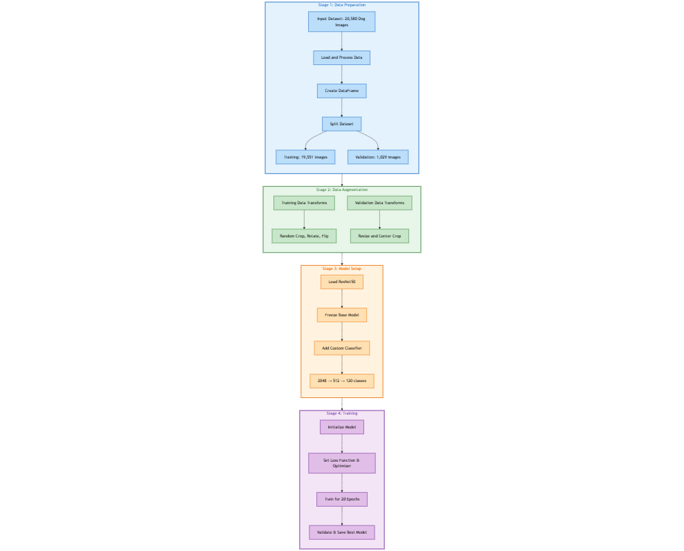

# Dog Breed Classification

## Overview
This project focuses on classifying dog breeds using a dataset of 20,580 labeled dog images. It uses transfer learning with a ResNet-50 base model, fine-tuned to classify 120 different dog breeds. The pipeline is structured into data preparation, augmentation, model setup, and training phases to ensure efficient and accurate training.



---

## Table of Contents
- [Overview](#overview)
- [Workflow](#workflow)
- [Dataset](#dataset)
- [Data Preparation](#data-preparation)
- [Data Augmentation](#data-augmentation)
- [Model Setup](#model-setup)
- [Training](#training)
- [Evaluation](#evaluation)
- [Results](#results)
- [Requirements](#requirements)
- [How to Run](#how-to-run)

---

## Workflow
### **Stage 1: Data Preparation**
- **Input Dataset**: 20,580 dog images.
- **Steps**:
  1. Load and preprocess the dataset.
  2. Create a DataFrame containing file paths and labels.
  3. Split the dataset:
     - **Training**: 19,551 images.
     - **Validation**: 1,029 images.

### **Stage 2: Data Augmentation**
- **Training Data Augmentations**:
  - Random cropping, rotation, flipping.
- **Validation Data Augmentations**:
  - Resizing and center cropping.

### **Stage 3: Model Setup**
- **Base Model**: ResNet-50 pretrained on ImageNet.
- **Steps**:
  1. Load the pretrained ResNet-50 model.
  2. Freeze the base model layers.
  3. Add a custom classifier:
     - Fully connected layers: 2048 → 512 → 120.

### **Stage 4: Training**
- **Steps**:
  1. Initialize the model.
  2. Set the loss function (CrossEntropyLoss) and optimizer (Adam).
  3. Train the model for 20 epochs.
  4. Validate after each epoch and save the best model.

---

## Dataset
- **Source**: Dataset contains 20,580 labeled dog images across 120 breeds.
- **Structure**: Images are organized by breed in subdirectories.
- **Annotation File**: Labels are provided in a `.mat` file.

---

## Data Preparation
1. **Load Annotations**: Load file paths and labels from the annotation file.
2. **Preprocess Data**:
   - Map labels to their corresponding images.
   - Validate that image paths exist.
3. **Split Dataset**: Use stratified sampling to create training and validation datasets.

---

## Data Augmentation
- **Training Transformations**:
  - RandomResizedCrop(224), RandomRotation(15), RandomHorizontalFlip.
- **Validation Transformations**:
  - Resize(256), CenterCrop(224).
- **Normalization**:
  - Mean: [0.485, 0.456, 0.406]
  - Std: [0.229, 0.224, 0.225]

---

## Model Setup
1. **Base Model**:
   - ResNet-50 pretrained on ImageNet.
   - Freeze all parameters to retain pretrained features.
2. **Custom Classifier**:
   - Fully connected layers:
     - Input: 2048
     - Hidden: 512 with ReLU and dropout.
     - Output: 120 (number of dog breeds).

---

## Training
- **Loss Function**: CrossEntropyLoss for multi-class classification.
- **Optimizer**: Adam optimizer with a learning rate of 0.0003.
- **Training Process**:
  1. Train for 20 epochs.
  2. Track training and validation losses and accuracies.
  3. Save the best model based on validation performance.
- **Hardware**: Utilizes GPU (if available) for faster training.

---

## Evaluation
- Validation accuracy and loss are tracked during training.
- Optionally, add a separate test dataset for final evaluation.

---

## Results
- **Validation Accuracy**: Achieved up to 86.79% after 20 epochs.
- **Best Model Saved**: Model checkpoints are saved when validation accuracy improves.

---

## Requirements
- **Programming Language**: Python 3.7+
- **Libraries**:
  - PyTorch
  - Torchvision
  - Torchmetrics
  - Scipy
  - Pandas
  - Matplotlib

---

## How to Run
1. **Clone Repository**:
   ```bash
   git clone <repository_url>
   cd dog_breed_classification
   ```

2. **Install Dependencies**:
   ```bash
   pip install -r requirements.txt
   ```

3. **Prepare Data**:
   - Place the dataset in the `data/images/Images` directory.
   - Ensure the `.mat` file is located in the `data/lists` directory.

4. **Run Training**:
   ```bash
   python train.py
   ```

5. **Evaluate Model**:
   ```bash
   python evaluate.py
   ```

---

## Acknowledgments
- The dataset and pretrained ResNet-50 model are critical components of this project.
- Special thanks to open-source libraries like PyTorch and Torchvision for simplifying deep learning development.

